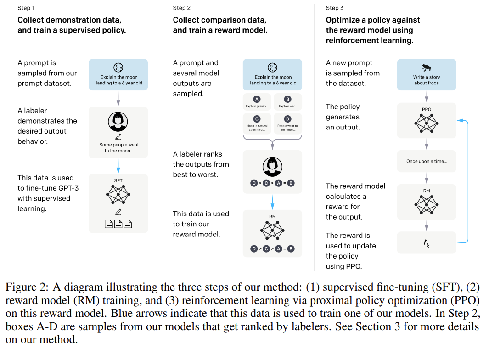
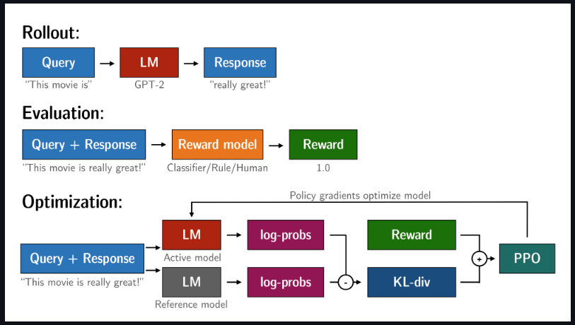
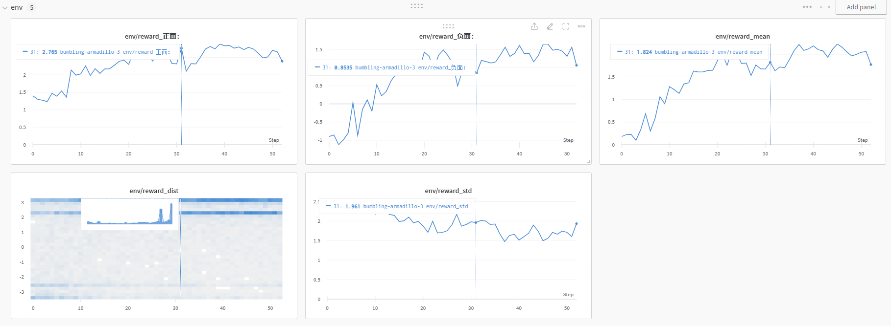

# 利用PPO进行可控文本生成

ChatGPT给我们带来了巨大的冲击，其原理大致可以分为三个步骤：



（1）第一步：有监督微调。这里我把它称为generate_model。

（2）第二步：训练一个奖励模型。注意，这个奖励模型和generate_model不是一个模型，我把它称为reward_model。

（3）第三步：在奖励模型的基础上，通过强化学习近端策略优化 （PPO）来优化generate_model，得到最终的模型ppo_generate_model。

接下来使用trl（transformer reinforcement learning）库来分别进行上面三个步骤，具体流程引用官网上的一张图：



# 实操

## 安装依赖

```python
pip install peft==0.2.0
pip install transformers==4.28.1
pip install accelerate==0.18.0
pip install loralib
pip install evaluate==0.4.0
pip install tqdm
pip install datasets==2.11.0
pip install deepspeed==0.9.1
pip install mpi4py
pip install trl==0.4.1
pip install wandb==0.15.0
```

python的版本要大于等于3.8，torch版本大于等于2.0。

## 准备数据

数据使用的是评论数据。

```python
wget https://raw.githubusercontent.com/SophonPlus/ChineseNlpCorpus/master/datasets/ChnSentiCorp_htl_all/ChnSentiCorp_htl_all.csv
```

加载数据我们使用datasets库。

## 1、使用GPT2训练生成模型

````python
python gpt2-chinese.py
````

```
loss：2.416899: 100%|██████████| 98/98 [01:51<00:00,  1.14s/it]
epoch:0/10 loss:2.7781832218170166
loss：2.174688: 100%|██████████| 98/98 [01:54<00:00,  1.17s/it]
epoch:1/10 loss:2.3192219734191895
loss：2.123909: 100%|██████████| 98/98 [01:55<00:00,  1.17s/it]
epoch:2/10 loss:2.037835121154785
loss：1.785878: 100%|██████████| 98/98 [01:55<00:00,  1.18s/it]
epoch:3/10 loss:1.7687807083129883
loss：1.466153: 100%|██████████| 98/98 [01:55<00:00,  1.18s/it]
epoch:4/10 loss:1.524872064590454
loss：1.465316: 100%|██████████| 98/98 [01:54<00:00,  1.17s/it]
epoch:5/10 loss:1.3074666261672974
loss：1.150320: 100%|██████████| 98/98 [01:54<00:00,  1.16s/it]
epoch:6/10 loss:1.1217808723449707
loss：1.043044: 100%|██████████| 98/98 [01:53<00:00,  1.16s/it]
epoch:7/10 loss:0.9760875105857849
loss：0.790678: 100%|██████████| 98/98 [01:53<00:00,  1.16s/it]
epoch:8/10 loss:0.8597695827484131
loss：0.879025: 100%|██████████| 98/98 [01:53<00:00,  1.16s/it]
epoch:9/10 loss:0.790839433670044
```

我们可以使用以下代码进行预测：

```python
from transformers import AutoTokenizer, GPT2LMHeadModel, TextGenerationPipeline, AutoModelForCausalLM
from datasets import load_dataset
data_file = "./ChnSentiCorp_htl_all.csv" # 数据文件路径，数据需要提前下载
dataset = load_dataset("csv", data_files=data_file)
dataset = dataset.filter(lambda x: x["review"] is not None)
dataset = dataset["train"].train_test_split(0.2, seed=123)

model_name_or_path = "uer/gpt2-chinese-cluecorpussmall"
tokenizer = AutoTokenizer.from_pretrained(model_name_or_path)
model = AutoModelForCausalLM.from_pretrained("./gpt2-chinese/")
text_generator = TextGenerationPipeline(model, tokenizer)  

import random
examples = dataset["train"]
example = random.choice(examples)
text = example["review"]
print(text)
print(text[:10])
text_generator(text[:10], 
        max_length=100, 
        do_sample=False, 
        top_p=0.8, 
        repetition_penalty=10.0,
        temperature=0.95,
        eos_token_id=0, 
        )
```

```python
第一次住在这里儿，我针对大家的意见，特别关注了一下，感觉如下吧！1、标准间虽然有点旧但很干净，被子盖得很舒服，也很暖和，卫生间也蛮大的，因是在商业中心离很多还算很近。2、酒店服务还算可以，没有像这里说的那样，入住时，退房时也挺快的，总的来说我很满意。3、早餐也还可以，环境也不错，有点江南的感觉；菜品种品也不少，挺可口。4、可能是在市或者离火车站的距离很近，稍微有点“热闹”，来找我办事的人不方便停车，但还好这里有地下停车场。总体来说，我感觉很不错，值得推荐！！！
第一次住在这里儿，我
[{'generated_text': '第一次住在这里儿，我 感 觉 很 温 馨 。 房 间 宽 敞 、 干 净 还 有 水 果 送 （ 每 人 10 元 ） ； 饭 菜 也 不 错 ！ 价 格 合 理 经 济 实 惠 ．'}]
```

## 2、使用roberta训练奖励模型

```python
python roberta-chinese.py
```

```
100%|██████████| 98/98 [01:29<00:00,  1.09it/s]
100%|██████████| 25/25 [00:08<00:00,  2.96it/s]
epoch 0 loss 7.461071968078613: {'accuracy': 0.8731487443657437}
100%|██████████| 98/98 [01:28<00:00,  1.11it/s]
100%|██████████| 25/25 [00:07<00:00,  3.16it/s]
epoch 1 loss 9.07374095916748: {'accuracy': 0.8576947842884739}
100%|██████████| 98/98 [01:28<00:00,  1.11it/s]
100%|██████████| 25/25 [00:07<00:00,  3.14it/s]
epoch 2 loss 6.963033676147461: {'accuracy': 0.8892466194462331}
100%|██████████| 98/98 [01:28<00:00,  1.11it/s]
100%|██████████| 25/25 [00:07<00:00,  3.16it/s]
epoch 3 loss 9.002013206481934: {'accuracy': 0.875724404378622}
100%|██████████| 98/98 [01:28<00:00,  1.11it/s]
100%|██████████| 25/25 [00:07<00:00,  3.13it/s]
epoch 4 loss 11.267653465270996: {'accuracy': 0.8815196394075981}
耗时：8.165430005391439分钟
```

我们可以使用以下代码进行预测：

```python
from transformers import pipeline
from transformers import AutoModelForSequenceClassification, AutoTokenizer
#指定分类器输出的格式
sent_kwargs = {
    "return_all_scores": True,
    "function_to_apply": "none",
    "batch_size": 16,
}

model = AutoModelForSequenceClassification.from_pretrained("./roberta-chinese/")
tokenizer = AutoTokenizer.from_pretrained("hfl/chinese-roberta-wwm-ext")
sentiment_pipe = pipeline("sentiment-analysis", model=model, tokenizer=tokenizer)
from datasets import load_dataset
data_file = "./ChnSentiCorp_htl_all.csv" # 数据文件路径，数据需要提前下载
dataset = load_dataset("csv", data_files=data_file)
dataset = dataset.filter(lambda x: x["review"] is not None)
dataset = dataset["train"].train_test_split(0.2, seed=123)

import random
examples = dataset["train"]
example = random.choice(examples)
text = example["review"]
print(text)
sentiment_pipe(text, **sent_kwargs)
```

```python
比较值，房间东东都比较新。主要是政府人员在此活动。商品部非常贵－－有点宰人！
[[{'label': 'LABEL_0', 'score': -3.8661129474639893},
  {'label': 'LABEL_1', 'score': 3.27480149269104}]]
```

## 3、利用PPO优化生成模型

```python
python ppo-chinese.py
```

```
100%|██████████| 30/30 [1:21:10<00:00, 162.36s/it]
 80%|████████  | 24/30 [1:04:19<15:56, 159.46s/it]
```

谷歌colab上训练的意外中断了，幸好保存了epoch-0的模型。



会看到正面的奖励和负面的奖励都在提高，说明我们的训练是有效果的。

我们可以这么预测：

```python
from transformers import AutoTokenizer, GPT2LMHeadModel, TextGenerationPipeline, AutoModelForCausalLM
from datasets import load_dataset
data_file = "./ChnSentiCorp_htl_all.csv" # 数据文件路径，数据需要提前下载
dataset = load_dataset("csv", data_files=data_file)
dataset = dataset.filter(lambda x: x["review"] is not None)
dataset = dataset["train"].train_test_split(0.2, seed=123)

model_name_or_path = "./ppo-chinese/epoch-0"
tokenizer = AutoTokenizer.from_pretrained(model_name_or_path)
model = AutoModelForCausalLM.from_pretrained(model_name_or_path)
text_generator = TextGenerationPipeline(model, tokenizer)  

import random
examples = dataset["train"]
example = random.choice(examples)
text = example["review"]
print(text)
print(text[:5])
prompt = "正面："
print(text_generator(prompt + text[:5], 
        max_length=20, 
        do_sample=False,
        eos_token_id=0, 
        ))
prompt = "负面："
print(text_generator(prompt + text[:5], 
        max_length=20, 
        do_sample=False,
        eos_token_id=0, 
        ))
```

```python
我是五一到二王庙宾馆的，有个新发现：就是都江堰景区与二王庙景点相通的。如果你从二王庙宾馆出来向前走约50米，就可以看到都江堰的一个入门口，买门票就可以进入景区，沿着景区往下游玩的话，可以一直到都江堰的正大门，也正好是山下都江堰市区了。反过来游玩也行。所以如果想去都江堰玩景区的，住二王庙宾馆是十分的方便。而且宾馆内部环境很幽雅，绿树成林，早晨还有一种鸟叫，听起来象个男人在练嗓子一样，真是很好玩．
我是五一到

[{'generated_text': '正面：我是五一到 的 ， 感 觉 还 可 以 。 房 间 比 较'}]
[{'generated_text': '负面：我是五一到 的 ， 前 台 服 务 员 态 度 不 好 ，'}]
==================================================
去开展会，住住还行。距离会展中心不是很远，交通也比较方便
去开展会，

[{'generated_text': '正面：去开展会， 还 不 错 。 房 间 比 较 干 净 、 整'}]
[{'generated_text': '负面：去开展会， 前 台 服 务 员 态 度 不 好 ， 房 间'}]
==================================================
一房得一大床不方便,最好一房安排有人床
一房得一大

[{'generated_text': '正面：一房得一大 享 受 ， 房 间 设 施 不 错 ， 前 台'}]
[{'generated_text': '负面：一房得一大 享 受 ， 前 台 服 务 一 般 ， 房 间'}]
==================================================
可能是在黄山上最便宜的一家酒店。当我下午2时拿到房间进去时，看到的是“美国式涂鸦”的墙壁和脏兮兮的被褥、黑乎乎的地板，太吓人了！我直接冲去前台与小姐理论，结果得到的是“网上房间照片和实物有差别，你要去找携程，山上就这条件”。但是在同层空置的房间看去来起码还能住，所以，突然让我感受到携程没优势呀！！后来在我的强烈要求给我换房了，呵呵！
可能是在黄

[{'generated_text': '正面：可能是在黄 山 口 对 面 ， 环 境 不 错 ， 房 间'}]
[{'generated_text': '负面：可能是在黄 山 上 ， 环 境 不 怎 么 样 ， 房 间'}]
==================================================
环境还是挺不错的，工作人员也比较热情，晚上保安巡逻发现窗户没关还电话提醒我们，赞一个！早餐略显一般！酒店门口就是峨眉特色小吃！离旅游车站非常近，线路方便！房间设施虽达不到四星的标准，但在景区也还不错了。可以推荐！
环境还是挺

[{'generated_text': '正面：环境还是挺 好 的 ， 房 间 比 较 干 净 、 整 齐'}]
[{'generated_text': '负面：环境还是挺 好 的 ， 房 间 小 ； 服 务 员 态 度'}]
==================================================
```

之前训练的时候设置的生成的文本的长度最大是20，所以这里我们也设置为20。主要是考虑到训练的时间。如果要得到更好的效果，需要把长度设置得更长。最后，总体看来，经过PPO优化后的生成模型时能够控制生成正面评论或者负面评论的。

# 参考

> [用强化学习神包trl轻松实现GPT2可控文本生成 - 知乎 (zhihu.com)](https://zhuanlan.zhihu.com/p/616036438)
>
> [[trl_peft\]微调GPT2来生成正面评论 | Kaggle](https://www.kaggle.com/code/tenffe/trl-peft-gpt2)
>
> [lvwerra/trl: Train transformer language models with reinforcement learning. (github.com)](https://github.com/lvwerra/trl)我呢